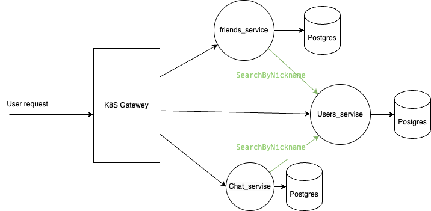

# moguchev_microservices_like_in_bigtech_5
microservices_like_in_bigtech_5

Д.з. 2 - 4

1)  Приложение разделено на 3 микросервиса
- users_service ,отвечает за работу с пользователями,реализует  функции
    - Регистрация пользователя (по почте и паролю + Oauth)
    - Вход/авторизация (по почте и паролю + Oauth)
    - Редактирование профиля пользователя (никнейм - уникальный, информация о себе, аватарка)
    - Поиск пользователей по никнейму
- friends_service ,отвечает за работу с друзьями,реализует  функции
    - Добавить пользователя в друзья
    - Убрать пользователя из друзей
    - Подтвердить или отклонить запрос на дружбу
    - Просмотр списка своих друзей (подтвердивших и не подтвердивших еще)
- chat_service ,отвечает за отправку и чтение сообщений
    - Написать сообщение другу
    - Получить сообщение из чата с пользователем

конкретная реализация - proto/api
база данных - Postgres, если бы были высокие функциональные требования на нагрузку можно было бы использовать распределенную базу, оптимизированую на запись, например  Apache Cassandra  

интерфейс для мобильных клиентов grpc, для дэсктоп - https

Вероятние всего для увеличения пропускной способности отправки и чтения сообщений нужно было бы использовать очередь Apache Kafka и разделить chat_service на части: несколько экземпляров воркера на чтение из очереди и запись на диск, и на каждого активного пользователя по два воркера - один пишет в очередь, второй читает из нее, но к сожеленью, времени чтобы это корректно реализовать не хавтит, поэтому выбрана более простая архитектура. 
